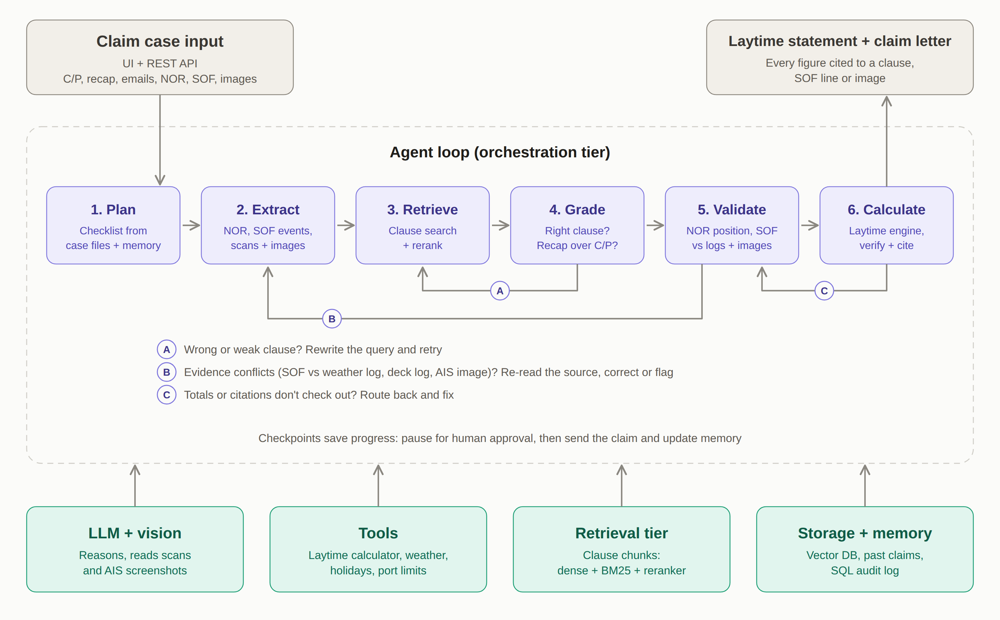
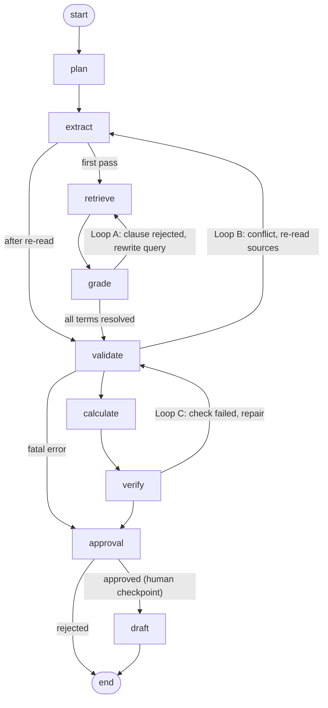

# Architecture

## Agent graph (generated from the code with `python run.py graph`)

## Nodes

| Node | Job | Tools / data | LLM role (if configured) |
|---|---|---|---|
| plan | Load case context, recall memory, write checklist, seed queries | `storage.recall()` | Refines the checklist |
| extract | Parse SOF table, classify + pair stoppages, parse NORs, read images. In loop B: targeted re-reads | `tools/documents.py`, `tools/evidence.py` | Classifies unclear SOF lines; vision on AIS / scan / deck log |
| retrieve | Hybrid search per pending term (all contract docs first, binding docs on retries) | `vectorstore.hybrid_search()` | - |
| grade | Grade each chunk, extract values, precedence check for recap/rider amendments, field-level merge | `tools/terms.py` | Grades + extracts JSON; rewrites failed queries |
| validate | NOR validity, commencement, chronology, rain vs weather log, exceptions, shifting, Sundays/holidays | weather, holidays, port geo, remarks | - (deterministic rules) |
| calculate | Minute-by-minute laytime engine, despatch/demurrage, time bar | `tools/laytime.py` | - |
| verify | Independent interval-arithmetic recomputation + citation checks | `tools/laytime.verify()` | - |
| approval | `interrupt()` - pause for a human decision, resume from the SQLite checkpoint | LangGraph checkpointer | - |
| draft | Claim letter from template, statement JSON/CSV, save lesson to memory | template, `storage.add_lesson()` | Polishes wording (figures must not change); writes the lesson |

## Precedence rules
`recap (3) > rider (2) > charter party (1)`; negotiation emails (0) are never binding; company manual (-1) is guidance only.
Resolution is per field: e.g. Case C takes the demurrage *rate* from the recap but *once on demurrage* from C/P Cl. 9.

## Storage
- By default, `storage/laytime.db` (SQLite); optionally, set `DATABASE_URL` to use PostgreSQL for tables `cases, documents, chunks, weather, holidays, ports, past_claims, lessons, runs, trace`
- `storage/chroma/` - vector index of clause chunks (metadata: case, doc type, precedence, clause ref)
- `storage/checkpoints.db` (SQLite default) or PostgreSQL when configured - LangGraph checkpoints (a paused run survives an app restart)
- `outputs/<run_id>/` - `claim_letter.md`, `laytime_statement.json`, `laytime_statement.csv`
- Uploaded source files remain under `data/cases/`; configure shared object storage separately if those must be centralized too.

## Design choices
- **LLM for reading and judgement, code for arithmetic.** Money figures always come from the deterministic engine and are re-verified independently.
- **Two sources before changing a fact.** Loop B only corrects or rejects SOF data when an independent source (weather log, AIS, signed scan, deck log) agrees.
- **Graceful degradation.** Every LLM call has a rule-based fallback, so the system runs offline (`LLM_PROVIDER=mock`) and never crashes on an API error.
